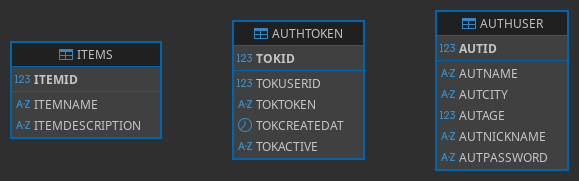

# REST API Login Register CRUD
## Funcionalidades
- Creacion de cuenta de usuario
- Inicio de sesion de usuario
- Modificacion de cuenta de usuario con autenticacion de token
- Eliminacion de cuenta de usuario con autenticacion de token
- Crear nuevo registro con autenticacion de token
- Listar registros con autenticacion de token
- Editar registro con autenticacion de token
- Eliminar registros con autenticacion de token
- Sistema de cron job para actualizacion de token
- Control de estados HTTP
## Tecnologías utilizadas
- **Backend:** PHP
- **Control de UTF-8:** mbstring
- **Base de datos:** MySQL
## Arquitecturas
- Monolitica
- Modular
## URL Docs
### Endpoints `/`
#### ➤ POST `/register.php`
Crea un nuevo usuario, genera un token y retorna los datos de usuario
- **Body**: `application/json`
```json
{
    "name": "Andres",
    "city": "Cansas",
    "age": 24,
    "user": "Andrew666",
    "password": "1234567"
}
```
- **Response:** `200 OK`
```json
{
    "error": false,
    "status": "200",
    "msg": "Get token for user",
    "data": {
        "token": "bb2d56ed670b9cd9732ac4154050cbcd",
        "id": 1,
        "name": "Andres",
        "city": "Cansas",
        "age": 24,
        "user": "Andrew666"
    }
}
```
#### ➤ POST `/login.php`
Logea un usuario ya registrado, genera un token y retorna los datos de usuario
- **Body**: `application/json`
```json
{
    "user": "Andrew666",
    "password": "1234567"
}
```
- **Response:** `200 OK`
```json
{
    "error": false,
    "status": "200",
    "msg": "Get token for user",
    "data": {
        "token": "97543eb2a1063a96247c1449690ac9fc",
        "id": "1",
        "name": "Andres",
        "city": "Cansas",
        "age": "24",
        "user": "Andrew666"
    }
}
```
#### ➤ GET `/get-user.php?id=X`
Obtiene los datos del usuario siempre y cuando se encuentre el token
- **Authorization:** `Bearer`
- **Params:** `?id=X` → ID del usuario, (Consultar ID en la base de datos) 
- **Response:** `200 OK`
```json
{
    "error": false,
    "status": "200",
    "msg": "Get user data",
    "data": {
        "id": "1",
        "name": "Andres",
        "city": "Cansas",
        "age": 24,
        "user": "Andrew666"
    }
}
```
#### ➤ POST `/update.php`
Actualiza los datos del usuario siempre y cuando se encuentre el token
- **Body**: `application/json`
- **Authorization:** `Bearer`
```json
{
    "id": "1",
    "name": "Andres Garcia",
    "city": "Cansas",
    "age": 24,
    "user": "Andrew666",
    "password": "1234567"
}
```
- **Response:** `200 OK`
```json
{
    "error": false,
    "status": "200",
    "msg": "User updated successfully",
    "data": "1"
}
```
#### ➤ DELETE `/delete.php?id=X`
Elimina los datos del usuario siempre y cuando se encuentre el token
- **Params:** `?id=X` → ID del usuario, (Consultar ID en la base de datos) 
- **Authorization:** `Bearer`
- **Response:** `200 OK`
```json
{
    "error": false,
    "status": "200",
    "msg": "User deleted successfully",
    "data": 1
}
```
#### ➤ GET `/list.php?page=X`
Obtiene la lista de todos los items por paginas cada 100 registros siempre y cuando se encuentre el token.
- **Authorization:** `Bearer`
- **Params:** `?page=X` → Cada que se introducen 100 registros, se separa en paginas
- **Response:** `200 OK`
```json
{
    "error": false,
    "status": "200",
    "msg": "Get all data",
    "data": [
        {
            "id": "101",
            "name": "Siemens Xelibri 2",
            "description": "Feature phone"
        },
        ...
    ]
}
```
#### ➤ GET `/list.php?id=X`
Obtiene los datos del item siempre y cuando se encuentre el token.
- **Authorization:** `Bearer`
- **Params:** `?id=X` → ID del usuario, (Consultar ID en la base de datos) 
- **Response:** `200 OK`
```json
{
    "error": false,
    "status": "200",
    "msg": "Get data",
    "data": {
        "id": "3",
        "name": "Lenovo A7-30 A3300",
        "description": "Android 4.2.2"
    }
}
```
#### ➤ POST `/list.php`
Crea un nuevo registro de item siempre y cuando se encuentre el token.
- **Body:** `application/json`
```json
{
    "name": "Gionee Elife S5.5",
    "description": "Android 4.2, upgrad&#1072"
}
```
- **Response:** `200 OK`
```json
{
    "error": false,
    "status": "200",
    "msg": "Saved data",
    "data": 234
}
```
#### ➤ PUT `/list.php`
Actualiza un registro de usuario existente por ID.
- **Body:** `application/json`
```json
{
    "id": 233,
    "name": "Siemens Xelibri 2",
    "description": "Feature phone"
},
```
- **Response:** `200 OK`
```json
{
    "error": false,
    "status": "200",
    "msg": "Updated data",
    "data": 233
}
```
#### ➤ DELETE `/list.php`
Elimina un registro de usuario por ID.
- **Body:** `application/json`
```json
{
    "id": 22
}
```
- **Response:** `200 OK`
```json
{
    "error": false,
    "status": "200",
    "msg": "Deleted data",
    "data": 22
}
```
# MODELO ENTIDAD RELACION: 
 <br>
# **Nota:** Antes de salir, pasate a ver las branches